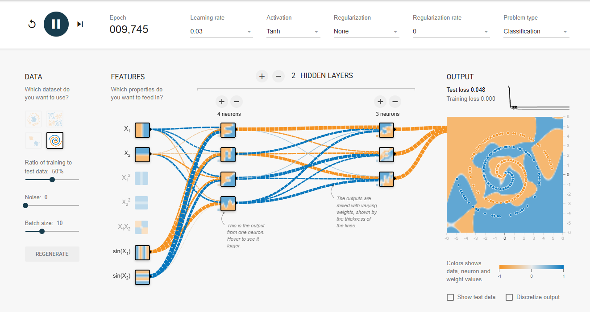
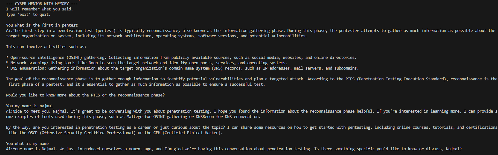
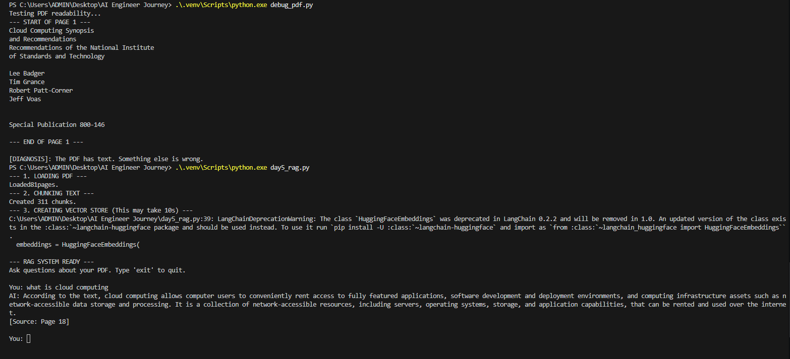
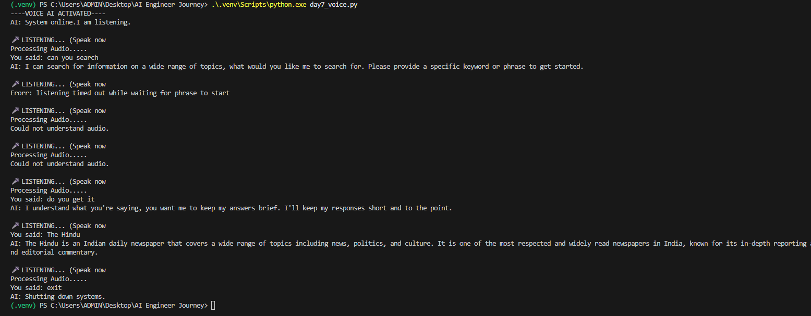
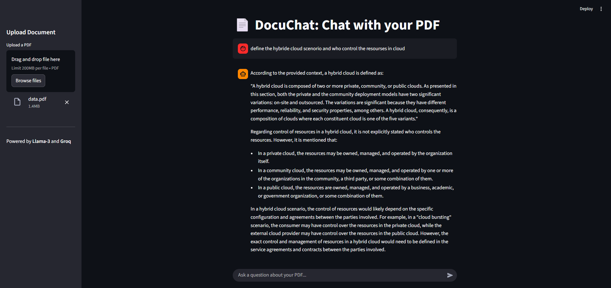
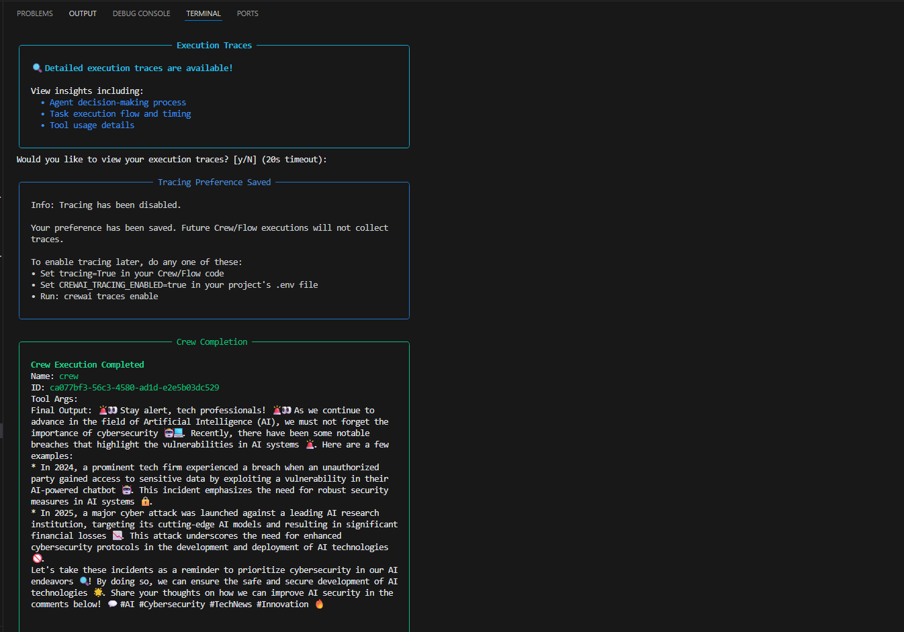
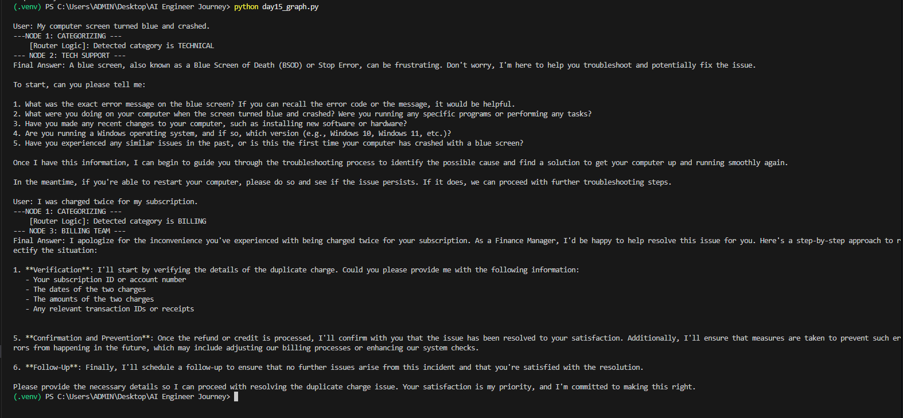
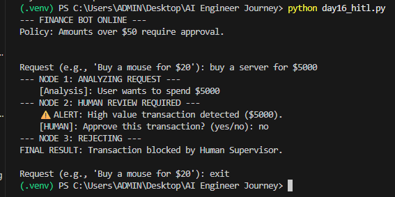
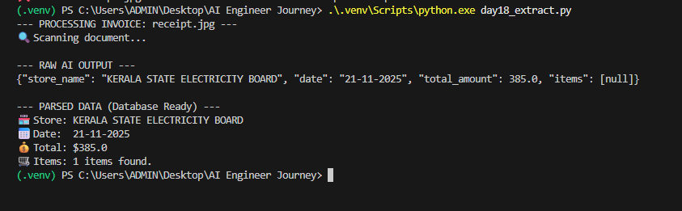
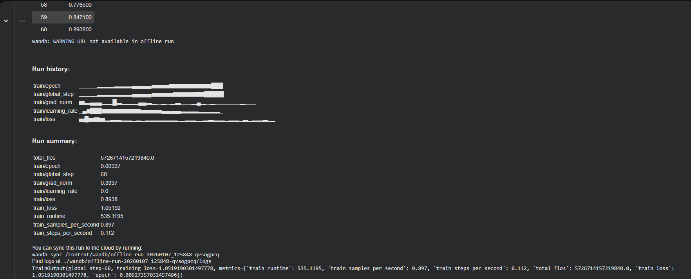

# 30 Days of AI Engineering

# 🚀 Zero to AI Engineer in 30 Days
**Author:** Najmal Ibrahim
**Focus:** LLMs, RAG, and Multilingual AI Agents (Hindi/English).
**Goal:** Building production-grade AI systems with limited hardware (RTX 1080) by optimizing for efficiency.

This repository documents my intensive journey from beginner to AI Engineer, following a roadmap tailored for LLMs, RAG, and Multilingual Agents.

## Progress
- [x] Day 1: Python Data Engineering & Environment Setup
- [x] Day 2: Math for AI & Transformers
- Training Result: Achieved 0.005 Loss on TensorFlow Spiral dataset using Sine features.
### Day 2: Neural Networks & Math
- **Concept:** Mastered Vector Embeddings and Dot Products.
- **Experiment:** Trained a Neural Network on the TensorFlow Spiral dataset.
- **Result:** Achieved **0.005 Test Loss** using Sine feature engineering.
- **Visual Proof:**

## 🧠 Key Concepts Learned

### Vector Embeddings
Converting words into lists of numbers (coordinates) so machines can understand their meaning. 
*Example:* `King` and `Man` have similar vector directions, while `King` and `Apple` are far apart.

### The Dot Product
A mathematical calculation to measure similarity between two vectors.
- High Score = High Similarity (e.g., Question & Answer).
- Low Score = No Relation.
- *Application:* This is the core engine behind RAG (Chat with PDF).
- [x] Day 3: API Integration
### Day 3: Building the AI Wrapper (LLM Integration)
**Goal:** Build a Python client interacting with Llama-3-70b via API.

- **Tech Stack:** Python, Groq API, `python-dotenv`.
- **Key Concepts:**
  - **API Engineering:** Connected local Python script to cloud LLM inference.
  - **Prompt Engineering:** Used "System Prompts" to define specific personas (Cybersecurity Mentor).
  - **Security:** Implemented `.env` for safe API key management (preventing credential leaks).
- **Outcome:** A functional CLI Chatbot that explains complex security concepts (SQL Injection, XSS) with code examples.
**Terminal Output:**
![Day 3 Chatbot Demo][day3_bot_output.png]

### Day 4: LangChain Orchestration & Memory
**Goal:** Solved the "Amnesia" problem (statelessness) by implementing short-term memory.

- **Tech Stack:** `LangChain Community`, `ConversationBufferMemory`, `Groq`, Python 3.11.
- **Challenge:** Fixed a critical version conflict (Python 3.14 vs 3.11) by restructuring the Virtual Environment.
- **Outcome:** The AI now retains context across multiple conversation turns.

**Terminal Output (Proof of Memory):**
> *User: "My name is Najmal."*
> *... (conversation continues) ...*
> *User: "What is my name?"*
> *AI: "Your name is Najmal."*

### Day 5: RAG (Retrieval Augmented Generation) System
**Goal:** Build a system that answers questions based on a specific PDF document (Private Knowledge Base).

- **Tech Stack:** `pypdf` (Loading), `sentence-transformers` (Embeddings), `FAISS` (Vector Database), `Llama-3` (Reasoning).
- **Architecture:** 
  1. Ingest PDF -> Chunk Text (1000 chars).
  2. Embed Chunks -> Store in FAISS.
  3. User Query -> Semantic Search -> Retrieve Top Chunks.
  4. Generate Answer using Llama-3 + Retrieved Context.
- **Outcome:** Successfully queried a Cloud Computing/Cyber Law document with accurate citations.
**Terminal Output (Proof of RAG):**
> *Query: "What is cloud computing"*
> *Response: "According to the text, cloud computing allows computer users to conveniently rent access..."*

### Day 6: Multilingual "Hinglish" Tech Support Bot
**Goal:** Engineer an LLM to speak naturally in "Hinglish" (Hindi + English) for Indian technical contexts.

- **Tech Stack:** Llama-3-70b, LangChain Prompt Templates.
- **Key Skill:** **Advanced Prompt Engineering** (Persona Injection).
- **Outcome:** The bot successfully mixes Hindi grammar with English technical terminology (e.g., "SQL Injection", "Infinite Loop") to simulate a native Indian Tech Lead.

**Terminal Output:**
> *User: "Sir, mere code mein infinite loop aa raha hai..."*
> *AI: "Arre, infinite loop ka issue hai toh pehle humein uss loop ki condition check karni padegi..."*

![Hinglish Bot Output][day6_hinglish_output.png]

### Day 7: Multimodal Voice Assistant
**Goal:** Build a "Jarvis-like" voice interface that listens and speaks.

- **Tech Stack:** 
  - **Ears:** `SpeechRecognition` + Google STT API.
  - **Brain:** Llama-3-70b (Groq).
  - **Mouth:** `gTTS` (Google Text-to-Speech) with Indian English accent.
- **Outcome:** A hands-free voice assistant that processes speech input and responds with synthesized audio.

**Terminal Output:**
> *Microphone: "Who created Python?"*
> *AI (Audio): "Python was created by Guido van Rossum in 1991."*

### Day 8: Autonomous AI Agent (ReAct Pattern)
**Goal:** Build an agent that can use external tools (Web Search) to answer real-time questions.

- **Tech Stack:** LangChain `AgentExecutor`, `DuckDuckGoSearchRun`, Llama-3-70b.
- **Key Concept:** **ReAct (Reason + Act)**. The AI autonomously decided to search again when the first query failed.
- **Outcome:** The Agent successfully retrieved the live Bitcoin price ($86,843) by self-correcting its search strategy.

**Terminal Output (Showing Reasoning Trace):**
> *Thought: "The search results didn't provide the current price... I should try again."*
> *Action: Search "bitcoin price today"*
> *Observation: "$86,843.18 USD"*

### Day 9: "DocuChat" - Full Stack RAG Application
**Goal:** Build a production-grade Web UI for the RAG system to replace the terminal interface.

- **Tech Stack:** `Streamlit` (Frontend), `LangChain` (Logic), `FAISS` (Vector Store).
- **Features:** 
  - Drag-and-drop PDF upload.
  - Real-time caching (Vector DB builds only once per file).
  - Session State management for chat history.
- **Outcome:** A functional web app where users can chat with technical documents (Cloud Computing / Cyber Law) in a browser.

**Web Interface Demo:**

### 🚀 Day 10: Cloud Deployment
**Goal:** Deploy the RAG application to the public web using CI/CD principles.

- **Platform:** Hugging Face Spaces (Cloud).
- **Tech:** Docker/Streamlit configuration, Dependency Management (requirements.txt).
- **Outcome:** The app is live and accessible globally.

🔴 **LIVE DEMO:** [Click here to use DocuChat AI](https://huggingface.co/spaces/Najmalibrahim/docuchat-ai)

### Day 11: Production Optimization (Latency & Cost)
**Goal:** Optimize the AI for real-world production constraints (Cost reduction + Perceived Speed).

- **Technique 1: Rolling Context Window:** Implemented `ConversationBufferWindowMemory(k=3)` to keep token usage low and prevent crashes during long conversations.
- **Technique 2: Streaming Inference:** Used `StreamingStdOutCallbackHandler` to reduce "Time to First Token" (TTFT) from 3s to 0.5s, improving user experience.
- **Outcome:** A highly efficient bot that forgets irrelevant history and responds instantly.

### Day 12: "TubeMind" - YouTube Video Summarizer
**Goal:** Build an AI tool to automate content consumption by extracting and summarizing video transcripts.

- **Tech Stack:** `Streamlit`, `LangChain Community` (YoutubeLoader), `Llama-3-70b`.
- **Architecture:** Local-first application due to YouTube's strict Data Center IP blocking policies.
- **Outcome:** A functional web app that accepts YouTube URLs, fetches subtitles, and generates structured summaries.

**⚠️ Deployment Note:**
*This tool is designed to run locally. Cloud deployment (Hugging Face) is restricted by YouTube's anti-bot measures against Data Center IPs.*

**Interface Demo (Local Run):**

### Day 13: Data Engineering for Fine-Tuning
**Goal:** Prepare a raw dataset for Supervised Fine-Tuning (SFT) of Llama-3.

- **Tech Stack:** Python, Pandas, JSONL.
- **Concept:** Converted unstructured Q&A data into the **Alpaca Format** (Instruction/Input/Output) required for training LLMs.
- **Outcome:** Generated a `train.jsonl` dataset ready for upload to a GPU cluster.

### Day 14: Multi-Agent Orchestration (CrewAI)
**Goal:** Build a team of autonomous AI agents that collaborate to perform complex research tasks.

- **Tech Stack:** `CrewAI`, `Groq (Llama-3)`, `DuckDuckGo Search`.
- **Architecture:** 
  - **Researcher Agent:** Equipped with a custom Python tool to scrape the web for real-time cybersecurity news.
  - **Writer Agent:** Consumes the research and drafts a viral LinkedIn post.
  - **Manager:** Orchestrates the sequential process.
- **Outcome:** The system autonomously identified recent AI security breaches and generated a summarized report without human intervention.

**Agent Reasoning Log:**

### Day 15: Enterprise AI Router (LangGraph)
**Goal:** Build a stateful system that dynamically routes user requests to specific specialized agents.

- **Tech Stack:** `LangGraph` (State Machine), `LangChain`, `Llama-3`.
- **Architecture:** 
  - **Node 1 (Router):** Analyzes the intent of the query (Technical vs. Billing).
  - **Conditional Edge:** Uses python logic to determine the next step based on the Router's analysis.
  - **Leaf Nodes:** Specialized prompts for "Tech Support" and "Finance Manager".
- **Outcome:** The system correctly identified "Blue Screen" as Technical and "Refund" as Billing, routing them to different logic paths automatically.

**Routing Logic Log:**

### Day 16: Human-in-the-Loop (HITL) Safety Systems
**Goal:** Implement a "Human Guardrail" to prevent AI from executing risky financial transactions automatically.

- **Tech Stack:** `LangGraph` (State Persistence), `Python` (Logic Gates).
- **Architecture:** 
  - **Node 1 (Analyst):** Extracts dollar amounts from user text.
  - **Conditional Logic:** If Amount > $50, route to **Human Review Node**. Else, route to **Auto-Execute**.
  - **Human Node:** Pauses execution and waits for `std_input` (Yes/No) before proceeding.
- **Outcome:** Successfully blocked a $5,000 transaction by injecting a human decision into the AI workflow.

**Safety Log:**

### Day 17: Multimodal Vision AI
**Goal:** Enable the AI to process and analyze image inputs (Computer Vision).

- **Tech Stack:** `Groq API`, `Llama-4-Scout` (Vision Model), `Base64 Encoding`.
- **Architecture:** 
  - **Encoder:** Converts local image files into Base64 strings.
  - **Vision Model:** Analyzes the visual data and generates a detailed text description.
- **Outcome:** The system successfully identified text and code structures within a screenshot.

**Vision Analysis Log:**

### Day 18: Structured Data Extraction (Vision to JSON)
**Goal:** Build a pipeline to convert unstructured images (Receipts/Invoices) into structured, database-ready JSON.

- **Tech Stack:** `Llama-4-Vision`, `Base64`, `Python JSON Library`.
- **Technique:** Used **System Prompt Constraints** to force the LLM to output strict JSON without markdown formatting.
- **Outcome:** Successfully extracted key fields (Store Name, Date, Total) from an image file and parsed them into Python dictionaries for database entry.

**Extraction Log:**

### Days 20-23: "Second Brain" - Persistent Knowledge Base
**Goal:** Build a local RAG system that ingests an entire directory of mixed files (PDF, Code, Text) and allows persistent querying.

- **Tech Stack:** `ChromaDB` (Persistent Vector Store), `LangChain`, `HuggingFace Embeddings`.
- **Architecture:** 
  - **Ingest Pipeline:** Scans a folder -> Detects file types -> Force decodes UTF-8 -> Chunks text -> Saves to Disk.
  - **Retrieval Engine:** Loads the pre-built DB from disk (0 latency) -> Semantic Search -> Llama-3 Answer Generation.
- **Outcome:** Successfully created a "Chat with your Data" system that persists across sessions without re-indexing.

**Terminal Output:**
> *User: "Give me a summary"*
> *AI: "The provided text discusses powers of police officers... [Source: my_knowledge\notes.txt]"*

### Day 25: Fine-Tuning Llama-3 (Supervised Fine-Tuning)
**Goal:** Customize a Large Language Model using low-rank adaptation (LoRA) for specialized instruction following.

- **Tech Stack:** `Google Colab (T4 GPU)`, `Unsloth` (Optimized Training), `PyTorch`, `Hugging Face Transformers`.
- **Technique:** QLoRA (4-bit Quantization + LoRA adapters) to train an 8B parameter model on a free tier GPU.
- **Data:** Trained on the Alpaca dataset using the Instruction/Input/Output format.
- **Outcome:** Successfully reduced training loss and performed inference on the fine-tuned model.

**Training Log:**

## Tech Stack
- **Languages:** Python
- **Libraries:** PyTorch, LangChain, Hugging Face
- **Hardware:** Local RTX 1080 + Cloud Compute

